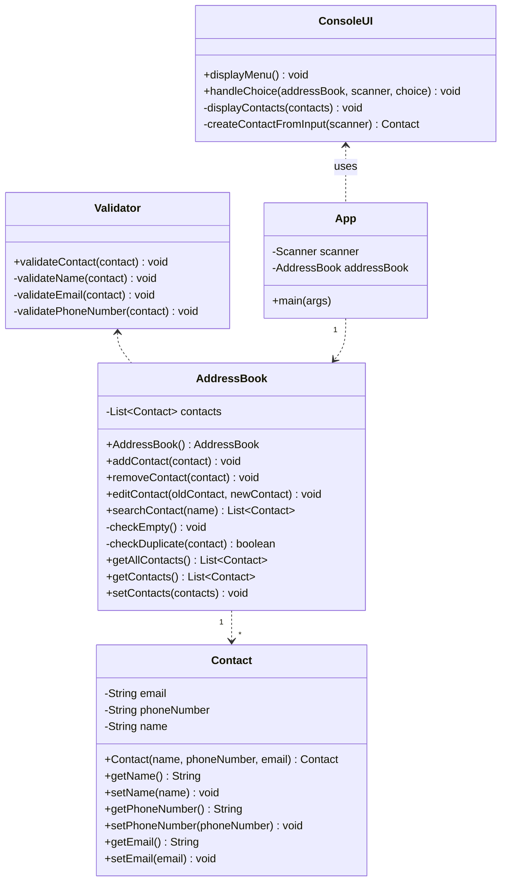

```mermaid
classDiagram 
ConsoleUI <.. App : uses
Validator <.. AddressBook 
App "1" ..> AddressBook
AddressBook "1" ..> "*" Contact
class Contact {
-String email
-String phoneNumber
-String name 
+Contact(name, phoneNumber, email) Contact
+getName() String
+setName(name) void
+getPhoneNumber() String
+setPhoneNumber(phoneNumber) void
+getEmail() String
+setEmail(email) void
}
class AddressBook {
-List~Contact~ contacts 
+AddressBook() AddressBook
+addContact(contact) void
+removeContact(contact) void
+editContact(oldContact, newContact) void
+searchContact(name) List~Contact~
-checkEmpty() void
-checkDuplicate(contact) boolean
+getAllContacts() List~Contact~
+getContacts() List~Contact~
+setContacts(contacts) void
}
class ConsoleUI {
+displayMenu() void
+handleChoice(addressBook, scanner, choice) void
-displayContacts(contacts) void
-createContactFromInput(scanner) Contact
}
class Validator {
+validateContact(contact) void
-validateName(contact) void
-validateEmail(contact) void
-validatePhoneNumber(contact) void
}
class App {
-Scanner scanner
-AddressBook addressBook
+main(args)
}
```