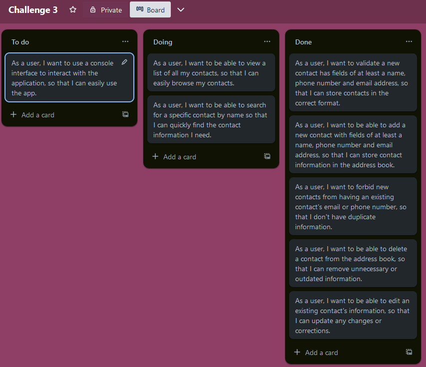

# Domain Models, Class Diagrams and Test Plan

## Task 1 

### What are the problems that the software will solve?
An address book app solves the problem of managing and organising contacts. People often find themselves struggling to manage numerous contacts between their many different apps and devices, making it challenging to keep track of all the details. An address book app provides a user-friendly solution to this problem.

### What are the benefits of the software to the user? 
- Contact management: The app allows users to store and access contact information such as names, phone numbers, and email addresses in a structured way, eliminating the need to keep physical address books, reducing the chance of losing important contacts.
- Efficient search and retrieval: Users can search for specific contacts, saving time and ensures that users can access the information they need quickly.
- Security: The app offers storage to users, ensuring safeguarding against data loss.

### What is the impact that the software will have on the customer's business? 
All benefits listed above contributes to a great impact on any customer's business, resulting in an overall competitive advantage over others who do not use this software to manage their contacts.

- Improved productivity: By providing users with a means of managing contacts, the app can enhance productivity by reducing the time spent searching for contact information.
- Cost Savings: The app can contribute to cost savings by reducing the need for printing physical address books as well as the time and effort required to maintain multiple books manually.
- Scalability and Flexibility: The address book app is scalable in that any number of contacts can be added and flexible in that it can be accessed through a console interface and quickly search for any contacts stored.

---

## Task 2 
### User stories, Domain models and test cases

As a user, I want to validate a new contact has fields of at least a name, phone number and email address, so that I can store contacts in the correct format.

| Requirement | Objects   | Properties                                                                    | Methods                                              |
|-------------|-----------|-------------------------------------------------------------------------------|------------------------------------------------------|
| 1           | Validator |                                                                               | public static void validateContact(Contact contact)  |
|             | Contact   | private String email   private String name   private String phoneNumber |                                                      |

#### Test cases
1. Test that validateContact throws an exception when contacts with null, empty or incorrect values are passed
2. Test that validateContact throws an exception when null, empty or incorrect values are passed as names, phone numbers and emails

---

As a user, I want to be able to add a new contact with fields of at least a name, phone number and email address, so that I can store contact information in the address book.

| Requirement | Objects     | Properties                                                                    | Methods                                  |
|-------------|-------------|-------------------------------------------------------------------------------|------------------------------------------|
| 2           | AddressBook | private List<Contact\> contacts                                               | public void addContact(Contact contact)  |
|             | Contact     | private String email   private String name   private String phoneNumber |                                          |

#### Test cases
1. Test that addContact adds a contact to the contacts array

---

As a user, I want to forbid new contacts from having an existing contact's email or phone number, so that I don't have duplicate information.

| Requirement | Objects     | Properties                                                                    | Methods                                  | 
|-------------|-------------|-------------------------------------------------------------------------------|------------------------------------------|
| 3           | AddressBook | private List<Contact\> contacts                                               | public void addContact(Contact contact)  | 
|             | Contact     | private String email   private String name   private String phoneNumber |                                          |       

#### Test cases
1. Test that a contact with the same email is not allowed to be added to the address book
2. Test that a contact with the same phone number is not allowed to be added to the address book

---

As a user, I want to be able to delete a contact from the address book, so that I can remove unnecessary or outdated information.

| Requirement | Objects     | Properties                                                                    | Messages                                   |
|-------------|-------------|-------------------------------------------------------------------------------|--------------------------------------------|
| 4           | AddressBook | private List<Contact\> contacts                                               | public void removeContact(Contact contact) |
|             | Contact     | private String email   private String name   private String phoneNumber |                                            |

#### Test cases
1. Test that removeContact removes a contact from the contacts array
2. Test that removeContact throws an exception when the contacts array is empty
3. Test that it returns an empty array when the contact does not exist

---

As a user, I want to be able to edit an existing contact's information, so that I can update any changes or corrections.

| Requirement | Objects     | Properties                                                                    | Methods                                                         | 
|-------------|-------------|-------------------------------------------------------------------------------|-----------------------------------------------------------------|
| 5           | AddressBook | private List<Contact\> contacts                                               | public void editContact(Contact oldContact, Contact newContact) | 
|             | Contact     | private String email   private String name   private String phoneNumber |                                                                 |       

#### Test cases
1. Test that given an existing contact, the new contact is updated to the address book
2. Test with an invalid contact in the oldContact parameter
3. Test with an invalid contact in the newContact parameter
4. Test with a oldContact that does not exist in the address book

---

As a user, I want to be able to view a list of all my contacts, so that I can easily browse my contacts.

| Requirement | Objects     | Properties                                                                    | Messages                               | 
|-------------|-------------|-------------------------------------------------------------------------------|----------------------------------------|
| 6           | AddressBook | private List<Contact\> contacts                                               | public List<Contact\> getAllContacts() | 
|             | Contact     | private String email   private String name   private String phoneNumber |                                        |

#### Test cases
1. Test that getAllContacts returns the entire array in the address book
2. Test when the address book is not holding any contacts

---

As a user, I want to be able to search for a specific contact by name so that I can quickly find the contact information I need.

| Requirement | Objects     | Properties                                                                    | Messages                                           |
|-------------|-------------|-------------------------------------------------------------------------------|----------------------------------------------------|
| 7           | AddressBook | private List<Contact\> contacts                                               | public List<Contact\> searchContacts(String query) |
|             | Contact     | private String email   private String name   private String phoneNumber |                                                    |

#### Test cases
1. Test that the contact that is searched for and the contact that is returned has the same attributes
2. Test that it throws an exception when the address book is empty
3. Test that it returns an empty array when the searched for contact does not exist

---

As a user, I want to use a console interface to interact with the application, so that I can easily use the app.

| Requirement | Objects   | Properties | Messages                                                                 |
|-------------|-----------|------------|--------------------------------------------------------------------------|
| 8           | ConsoleUI |            | public static void displayMenu()    public static void handleChoice() |

#### Test cases
1. Test that a menu is shown
2. Test that a contact can be added
3. Test that contacts can be edited
4. Test that contacts can be removed
5. Test that all contacts can be viewed
6. Test that contacts can be searched for
7. Test that the app can be quit

### Kanban

---
